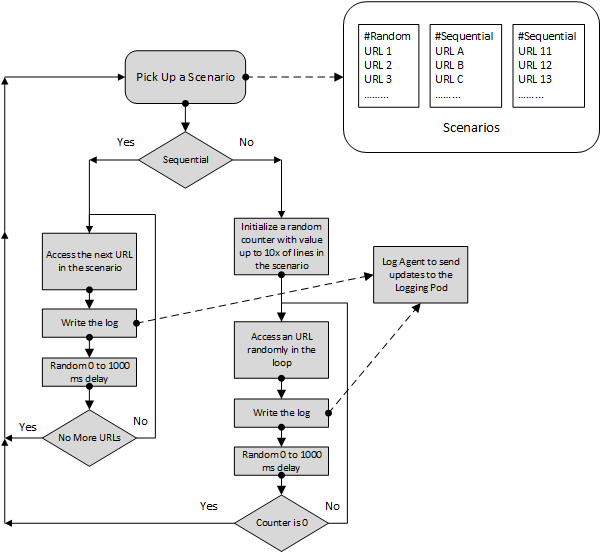
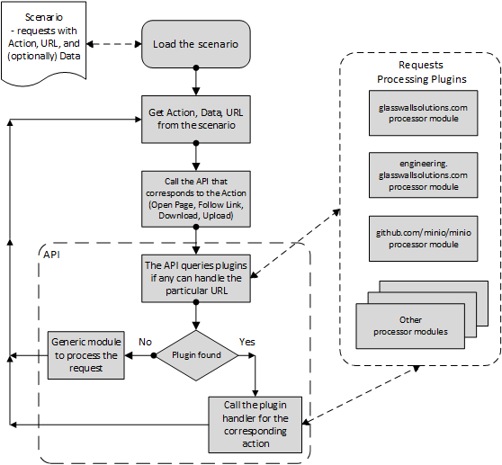
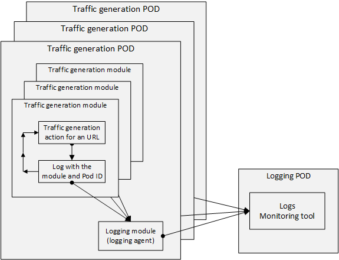

#The Workflow
## Traffic generation by a POD
The PODs in k8 traffic generation deployments will generate traffic based on scenario files. Each instruction line in a scenario file defines the action to be taken (open a page, follow a link, upload a file, download a file), the URL, and if necessary the data (for instance, location of the file to be uploaded). 

There will be two types of scenarios: random and sequential. 

Once a random scenario is read, the traffic generator picks up instructions from the scenario randomly and executing them. This means that some of the instructions will be executed multiple times. To increase the probability that all the instructions from a random scenario are executed, the traffic generator will run significantly more iterations than the number of instructions in the scenario. 

In the case of a sequential scenario, the traffic generator will execute all the instructions in the order they are placed in the scenario file until all the instructions are executed. 

Every POD can contain multiple scenario files. The traffic generator will pick up a single scenario at a time, execute it, and then move to the next (randomly picked up) scenario. The process will repeat in an infinite loop.

## Multiple sites support

To support customized actions for different URLs on different websites, the traffic generators will implement expandable APIs for supported actions (open a page, follow a link, upload a file, download a file).

Support of different web-site will be modularized into plugins. This will allow one to easily add/remove the support of necessary/unnecessary websites on a particular POD.  

When executing a particular instruction the API will check if any of the plugins support the particular instruction. If yes, the handling of the instruction will be passed to the plugin. Otherwise, generic processing will be applied. 

## Logging
All actions performed by the traffic generator are to be logged, traces, and metrics are to be collected.

Traffic generation PODs will be allocated and deleted dynamically. So storing any kind of info withing the PODs won't make much sense. Because of that logs (traces, metrics) are to be transferred to a persistent location. Special PODs running log/metrics collection/analysis tools will be utilized for the purpose. 

The following options are currently considered to be utilized as logs/traces/metrics monitoring tools: 
- https://www.elastic.co/
- https://www.jaegertracing.io/
- https://min.io/
- http://logio.org/
- https://opencensus.io/

